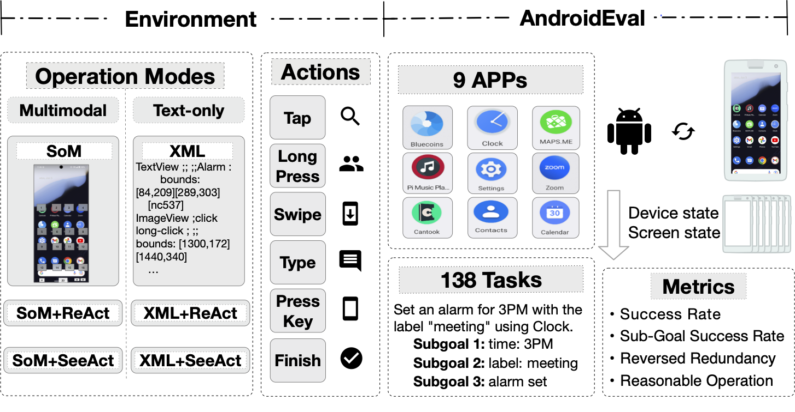
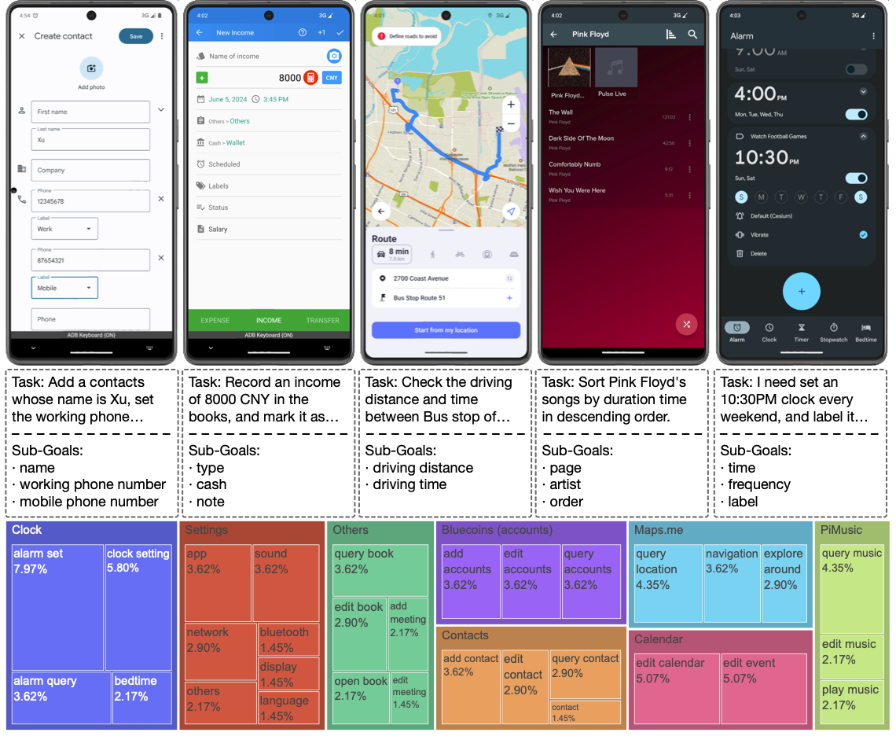
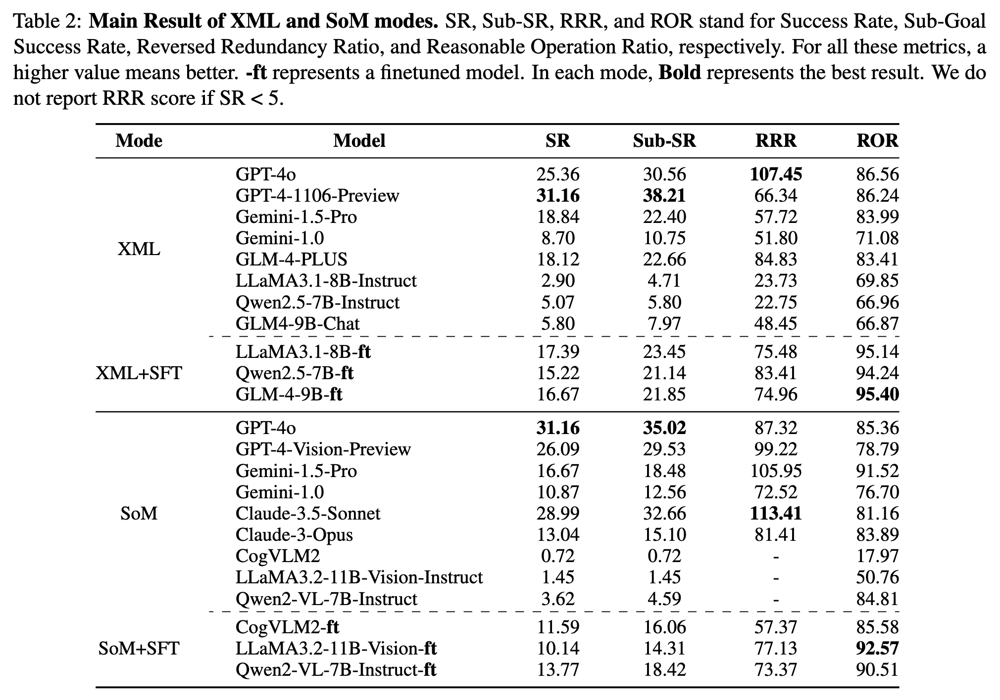
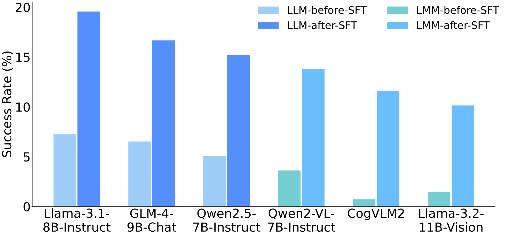

# AndroidLab: 开发和评估可重现环境中的 Android Agents

英文版本的 README 请点击 [这里](README.md)。

自主代理在与现实世界交互中变得越来越重要。Android agents是最近被频繁提及的交互方式。然而，现有关于开发和评估 Android agents 的研究在可重现性和任务难度的结合上表现不足。在本工作中，我们提出了 AndroidLab 作为一个系统化的 Android agent 框架。它包含了一个具有操作模式、操作空间和可重现基准的操作环境——AndroidEval。它支持在同一操作空间中使用大型语言模型（LLMs）和多模态模型（LMMs）。AndroidEval 包含预定义的 Android 虚拟设备和基于这些设备构建的跨九款应用的 138 个任务。利用 AndroidLab 环境，我们开发了 Android Instruction 数据集，并训练了六个开源 LLM 和 LMM，将 LLM 的平均成功率从 4.56% 提升到 16.43%，LMM 从 1.93% 提升到 11.83%。

该代码库是 Android Eval 部分的代码框架。我们提供了两种执行模式：在 Mac（arm64）上的 AVD 模式和在 Linux（x86_64）上的 Docker 模式。您可以根据我们的框架自由添加或修改新任务或 Android 镜像。我们提供了完整的评估框架，可用于评估各种 Android agents 的性能。



# 基准测试组件

在我们的实验中，我们利用了一系列应用程序来进行各种测试。选择的移动应用程序如下：

- **Bluecoins**: 一个个人财务管理应用程序，用于跟踪支出和收入。
- **Calendar**: 一个日历应用程序，帮助组织日程安排和设置提醒。
- **Cantook**: 一个电子书阅读器，用于存储、管理和阅读电子书。
- **Clock**: 一个时钟应用程序，用于显示时间、设置闹钟和使用秒表。
- **Contacts**: 一个联系人管理应用程序，用于存储和组织联系信息。
- **Maps.me**: 一个离线地图应用程序，用于导航和探索位置。
- **PiMusic**: 一个音乐播放器应用程序，用于组织和播放本地存储的音乐文件。
- **Settings**: 一个设置应用程序，用于配置设备设置和偏好。
- **Zoom**: 一个视频会议应用程序，用于主持和参加在线会议。

这些应用的选择经过了多次迭代，以确保它们适合我们的评估目的。最终选择的关键标准是每个应用必须能够独立运行，不需要互联网连接或用户账户登录。这确保了评估可以在相同条件下始终如一地重复进行，消除了外部依赖并减少了隐私泄露的风险。因此，这种方法保持了我们结果的可靠性和可重复性。



# 排行榜

XML 和 SoM 模式的主要结果。SR、Sub-SR、RRR 和 ROR 分别代表成功率、子目标成功率、反向冗余率和合理操作率。对于所有这些指标，值越高越好。**-ft** 代表一个指令微调模型。在每种模式下，**加粗** 代表最好的结果。



通过使用 Android Instruct 数据集，我们训练了六个开源的文本和多模态模型，分别实现了 395% 和 896% 的平均提升，达到了与专有模型相当的性能水平。




# 快速开始

## 自动评估

我们提供了两种测试方法：Mac上的AVD（arm64）和Linux上的Docker（x86_64）。

### 环境配置

克隆此仓库并安装依赖项。

```bash
cd /path/to/your/repo
conda create -n Android-Lab python=3.11
conda activate Android-Lab
pip install -r requirements.txt
```

如果您使用的是Mac上的AVD（arm64），请参考[这里](docs/prepare_for_mac.md)来设置环境。

如果您使用的是Linux上的Docker（x86_64），请参考[这里](docs/prepare_for_linux.md)来设置环境。

### 运行自动评估Pipeline

运行：

```bash
python eval.py -n test_name -c your path to config.yaml
```

每个问题的具体输出保存在`./logs/evaluation/test_name`下，评估结果保存在`output`文件夹中。

如果您只想运行几个问题进行测试，可以参考：

```bash
python eval.py -n test_name -c your path to config.yaml --task_id taskid_1,taskid_2,taskid_3
```

我们支持并行测试。请注意，您需要提前确认有足够的内存和存储空间。每个并发测试大约占用6G内存和9G存储空间。

```bash
python eval.py -n test_name -c your path to config.yaml -p 3
```

每个问题的task_id可以在`evaluation/config`中找到。

使用以下代码生成评估结果：

```bash
# gpt-4o-2024-05-13评测:
export OPENAI_API_KEY='your-api-key-here'
python generate_result.py --input_folder ./logs/evaluation/ --output_folder ./logs/evaluation/ --output_excel ./logs/evaluation/test_name.xlsx --judge_model gpt-4o-2024-05-13

# glm4评测:
python generate_result.py --input_folder ./logs/evaluation/ --output_folder ./logs/evaluation/ --output_excel ./logs/evaluation/test_name.xlsx --judge_model glm4 --api_key your api key
```

你需要根据需求填写 judge model和api_key或 api_base。我们现在支持gpt-4o-2024-05-13 和 glm4。generate_result.py将在--input_ir下生成所有测试结果的Excel文件，包含每个问题的详细结果。

## 如何修改基础模型

`Agent`类已在`agent/`文件夹中预定义，包含基于oneapi的OpenAI接口和当前部署的GLM接口的实现。如果需要添加基础模型，您需要：

1. 在`agent/`下创建一个新的Python文件，并参考`agent/model/OpenAIAgent`，通过继承`Agent`类实现您的模型调用。`act`函数输入已经按照OpenAI message格式组织，输出为字符串。如果对应模型的输入格式与OpenAI不同，可以参考`claude_model`中的`format_history`函数和`qwen_model`中的`prompt_to_message`进行修改。`format_history`可以组织历史记录格式，`prompt_to_message`方法将当前回合的提示和图像输入（如果有）修改为当前模型的单回合格式。
2. 在`agent/__init__.py`中导入您的新类。
3. 将`eval.py`使用的配置文件中的`agent`内容替换为：

```yaml
agent:
    name: Your Agent Module Name
    args:
        max_new_tokens: 512
```

确保名称与您实现的类名匹配，`args`下的内容将传递给您的类的`init`函数。

## 添加新任务的步骤

在编写新任务的过程中，编写代码并通过实际运行结果确定代码是否正确同样重要。因此，请按照以下步骤确保每个新任务没有错误。

1. 编写您的任务。任务包括yaml文件、评估方法和相应的移动应用安装。
    1. 任务的yaml文件应参考`evaluation/config`下的其他现有文件，必须包含`task_id`、`task`、`metric_type`和`metric_func`。`adb_query`仅在需要通过adb命令查询结果时使用。尽管`category`目前尚未使用，但强烈建议添加。
    2. 评估方法需要继承`evaluation/task/SingleTask`类。在每次记录操作后，`judge`函数将执行，其返回值为一个字典：`{"judge_page": bool, "1": bool, ..., "complete": bool}`。代码将记录`judge_page`为`True`的最后一页的判断结果，且只有当所有判断点都正确时才应将`complete`设置为`True`。如果是一个比较返回值的任务，`check_answer`方法已经实现。在调用此函数之前，修改`final_ground_truth`为标准答案。
    3. 参考其他任务，将所有评估方法导入`evaluation/app_name/__init__.py`中的`function_map`类。
    4. 为确保模型能够正确执行启动命令，请在`templates/packages/apps_dict`中添加应用名称和相应的包名。包名可以通过执行`adb -s {device} shell dumpsys window | grep mCurrentFocus | awk -F '/' '{print $1}' | awk '{print $NF}'`获取。
2. 使用至少最先进的智能体执行您的任务并生成评估结果。如有必要，在模型操作间隔期间快速完成正确的操作，以确保记录的操作能够捕获两次模型操作之间的正确结果页面，从而测试您的代码是否能够完成检测任务。
3. 使用`tools/check_result_multiprocess.py`函数生成每一步的截图。重点检查正确的模型操作截图是否确实被判断 为正确。

## 更改AVD快照的步骤

如果您想定义一个与android eval快照不同的移动快照，您需要遵循以下步骤：

1. 从链接下载相关docker_no_avd文件：https://drive.google.com/file/d/1xpPEzVof5hrt5bQY6BHm_4Uoyq5mJQNb/view?usp=drive_link
2. 解压文件，进入解压后的文件夹，然后运行：

```bash
docker build -t android_eval_no_avd:latest .
```

3. 在x86_64机器上配置您的AVD快照（建议直接使用Android Studio进行配置）。请注意，默认安装的Android AVD类型为：

```dockerfile
RUN /bin/bash -c "source /root/.bashrc && yes | sdkmanager 'platform-tools' 'emulator' 'system-images;android-33;google_apis;x86_64'"
RUN /bin/bash -c "source /root/.bashrc && yes | sdkmanager 'build-tools;33.0.0'"
RUN /bin/bash -c "source /root/.bashrc && yes | sdkmanager 'platforms;android-33'"
```

如果您想配置不同版本的AVD，请修改Dockerfile中安装的具体版本号。请注意，版本号必须严格一致，否则安装的镜像将无法读取现有缓存。

4. 您可以使用以下代码生成docker中使用的AVD镜像：

```python
python tools/modify_mobile_to_docker.py 
    --avd_dir /Path/to/your/.android/avd 
    --device_name your device name 
    --save_dir /Path/to/your/save/avd
```

或者，您可以按如下方式修改：

通过Android Studio -> 虚拟设备管理器 -> 右键 -> 在磁盘上显示，找到您的.avd文件夹和.ini文件，并进行以下修改：

在Pixel_7_Pro_API_33.ini中，将路径和path.rel修改为以下路径：

```ini
avd.ini.encoding=UTF-8
path=/root/.android/avd/device name.avd
path.rel=avd/device name.avd
target=android-33
```

在Pixel_7_Pro_API_33.avd/config.ini中，修改以下路径：

```ini
...
image.sysdir.1 = system-images/android-33/google_apis/x86_64/
...
skin.path = /root/.android/skins/pixel_7_pro
...
```

保持其他内容不变。

5. 启动一个镜像并将您的.avd文件夹和.ini文件复制到镜像中：

```bash
docker run -it  android_eval_no_avd:latest /bin/bash 
docker cp /path/to/your/device name.avd container_id:/root/.android/avd
docker cp /path/to/your/device name.ini container_id:/root/.android/avd
```

完成上述操作后，您可以在镜像中执行以下操作：

```bash
emulator -avd device name -no-window -no-audio -no-snapshot-save
```

验证安装是否成功。

